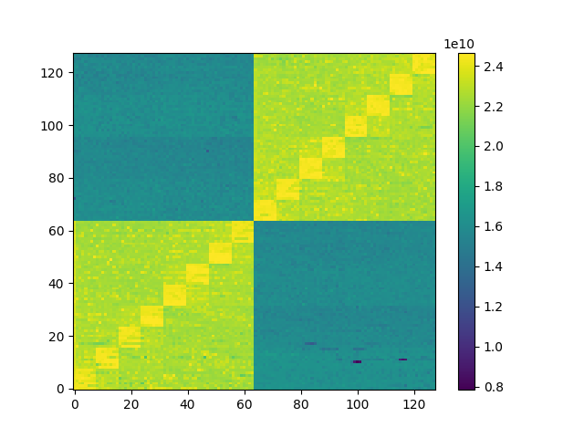

# memmapper

A simple C program to map memory bandwidth on nodes. It will run and average arbitrary transfers from core-to-core.

## Installation

The program only depends on `hwloc` and locates it using `pkg-config`.

```sh
git clone https://github.com/besnardjb/memmapper.git
cd memmapper
# Makefile is trivial
make
```

## Usage

```
mapper -s [SIZE] -i [ITER] -o [OUTPUT JSON]
-s : total size to move in bytes
-i : number of averaging iterations
-o : output json file
```

## Plot

Considering a file is generated with the `-o` option, it is possible to plot it using the embedded python script (requires `matplotlib`).

```sh
# If you do not have matplotlib (or are unsure)
pip install matplotlib
# Now the plot command (direct viz for a run with -o out.json)
./plot.py -i out.json
# It is also possible to generate output files directly
./plot.py -i out.json -o out.eps
```

### Sample Output



